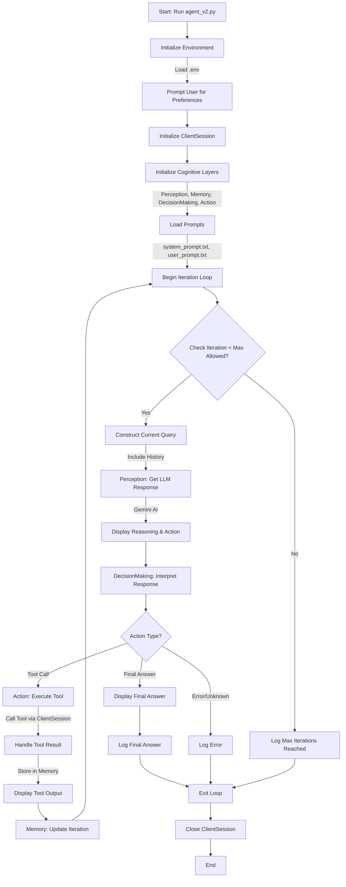

# AI Agent Framework

The AI Agent Framework is a powerful tool for automating complex tasks through AI-driven reasoning and external tool integration.

## Table of Contents

- [Overview](#overview)
- [System Architecture](#system-architecture)
- [Features](#features)
- [Prerequisites](#prerequisites)
- [Installation](#installation)
- [Configuration Options](#configuration-options)
- [Usage](#usage)
- [Tool Descriptions](#tool-descriptions)
- [Logging](#logging)
- [Error Handling](#error-handling)
- [Performance Considerations](#performance-considerations)
- [Troubleshooting](#troubleshooting)
- [Future Development Plans](#future-development-plans)
- [Contributing](#contributing)
- [License](#license)
- [Contact Information](#contact-information)
- [Version Information and Changelog](#version-information-and-changelog)

## Overview

The AI Agent Framework is a sophisticated, modular system designed to execute complex tasks iteratively through the integration of external tools and advanced AI reasoning capabilities. It leverages a structured approach to task execution, incorporating perception, memory, decision-making, and action components to ensure precise and reliable outcomes. This framework is particularly suited for applications requiring sequential task processing, tool integration, and user preference-driven outputs.

## System Architecture

The framework is built on a modular architecture comprising the following components:

- **Perception**: Interfaces with the Gemini AI model to generate reasoning and responses.
- **Memory**: Manages iteration tracking, response storage, and history generation.
- **DecisionMaking**: Interprets AI responses and determines the next action.
- **Action**: Executes tool calls via the ClientSession.

These components interact seamlessly to process tasks step-by-step, ensuring that each action is based on the latest information and reasoning.

## Features

- **Modular Architecture**: Ensures clear separation of concerns and ease of maintenance.
- **Tool Integration**: Supports a variety of external tools for diverse tasks.
- **Multiple Reasoning Types**: Implements lookup, arithmetic, planning, tool-use, validation, and communication reasoning.
- **User Preferences**: Allows customization of task execution and outputs.
- **Robust Error Handling**: Manages tool failures and validation errors effectively.
- **Structured JSON Output**: Ensures consistency and interoperability.
- **Comprehensive Logging**: Facilitates monitoring and debugging.



This Mermaid diagram illustrates the workflow of the **AI Agent Framework** as implemented in `agent_v2.py`. It captures the initialization process, iterative task execution, decision-making, tool usage, and termination conditions, reflecting the modular and structured nature of the system.

## Prerequisites

To use the AI Agent Framework, ensure the following are met:

- Python 3.8 or higher
- Dependencies listed in `requirements.txt`
- **Environment variables**:
  - `GEMINI_API_KEY`
  - `SENDER_EMAIL`
  - `GMAIL_APP_PASSWORD`
  - `TELEGRAM_API_KEY`
- Windows operating system (for Microsoft Paint integration)
- Microsoft Paint installed

**Note**: Usage of the Gemini API, Gmail SMTP, and Telegram Bot API is subject to their respective terms of service and rate limits. Ensure compliance with these terms when using the framework.

## Installation

1. Clone the repository:
   ```bash
   git clone <repository_url>
   ```
2. Navigate to the directory:
   ```bash
   cd <repository_directory>
   ```
3. Set up a virtual environment:
   ```bash
   python -m venv venv
   source venv/bin/activate  # On Windows: venv\Scripts\activate
   ```
4. Install dependencies:
   ```bash
   pip install -r requirements.txt
   ```
5. Configure environment variables in a `.env` file:
   ```plaintext
   GEMINI_API_KEY=<your_gemini_api_key>
   SENDER_EMAIL=<your_gmail_address>
   GMAIL_APP_PASSWORD=<your_gmail_app_password>
   TELEGRAM_API_KEY=<your_telegram_bot_token>
   ```

## Configuration Options

The framework offers the following customizable settings:

- **Iteration Limit**: Default is 9. Adjust in `memory.py` by modifying `self.max_iterations`.
- **Screen Coordinates for Paint Tools**: May need adjustment based on screen resolution. Update coordinates in `mcp_server_pydantic.py`.

## Usage

To run the framework:

1. Execute the main script:
   ```bash
   python agent_v2.py
   ```
2. When prompted, provide your preferences for task execution (e.g., communication method).
3. The system will process the task sequence defined in `user_prompt.txt`, displaying outputs in a rich console interface.

### Quick Start

1. Clone the repository and navigate to the directory.
2. Set up a virtual environment and install dependencies.
3. Configure environment variables in `.env`.
4. Run `python agent_v2.py` and follow the prompts.

**Example Execution:**

The framework generates Fibonacci numbers, computes their squares or cubes, sums the results, performs graphical operations in Microsoft Paint, and sends the results via email or Telegram based on your preferences.

**Sample Output:**

```json
{
  "reasoning": "To begin the task, I need to generate the first 5 Fibonacci numbers as specified.",
  "action": {
    "type": "function_call",
    "tool_name": "find_first_fibonacci_numbers",
    "tool_input": {"n": 5}
  }
}
```

## Tool Descriptions

The framework supports the following tools:

- **strings_to_chars_to_int**: Converts a string to its ASCII values.
- **int_list_to_exponential_sum**: Computes the sum of exponentials of a list of numbers.
- **find_first_fibonacci_numbers**: Generates the first `n` Fibonacci numbers.
- **calculate_cubes**: Computes the cubes of a list of numbers.
- **calculate_squares**: Computes the squares of a list of numbers.
- **calculate_sum**: Calculates the sum of a list of numbers.
- **open_paint**: Opens and resets Microsoft Paint.
- **draw_rectangle**: Draws a rectangle in Microsoft Paint.
- **add_text_in_paint**: Adds text to the Paint canvas.
- **send_email**: Sends an email via Gmail SMTP.
- **send_telegram**: Sends a message via Telegram Bot API.

## Logging

- **Agent Logs**: Stored in `agent.log` with details on iterations, AI responses, and errors.
- **MCP Server Logs**: Stored in `mcp_server.log` for tool execution details.
- Logs include timestamps and log levels for effective debugging.

## Error Handling

The framework implements robust error handling:

- **Tool Errors**: Retries failed tool calls once if logical; otherwise, skips the step.
- **Validation Errors**: Uses Pydantic to validate tool inputs and outputs, logging any issues.
- **Unexpected Results**: Stores partial results and uses placeholders to continue execution.

## Performance Considerations

- **Execution Time**: Varies based on task complexity and tool response times.
- **Memory Usage**: Moderate, depending on the data processed in tasks.
- **API Rate Limits**: Subject to the constraints of the Gemini API.

## Troubleshooting

Common issues and solutions:

- **API Key Errors**: Ensure environment variables are correctly set in the `.env` file.
- **Tool Failures**: Verify that Microsoft Paint is installed and accessible.
- **Invalid JSON Output**: Check the AI model's response format and adjust prompts if necessary.

## Future Development Plans

Planned enhancements include:

- Cross-platform support for graphical operations.
- Integration of additional tools for broader task capabilities.
- Improved error handling and recovery mechanisms.

## Contributing

Contributions are welcome. To contribute:

1. Fork the repository.
2. Create a feature branch (`git checkout -b feature/<feature_name>`).
3. Commit your changes (`git commit -m "Add <feature_name>"`).
4. Push to the branch (`git push origin feature/<feature_name>`).
5. Open a pull request with a detailed description of your changes.

## License

This project is licensed under the MIT License. See the `LICENSE` file for details.

## Contact Information

For inquiries or support:

- **Email**: <maintainer_email>
- **GitHub Issues**: <repository_url>/issues

## Version Information and Changelog

- **Current Version**: 1.0.0
- **Changelog**:
  - 1.0.0: Initial release of the AI Agent Framework.
