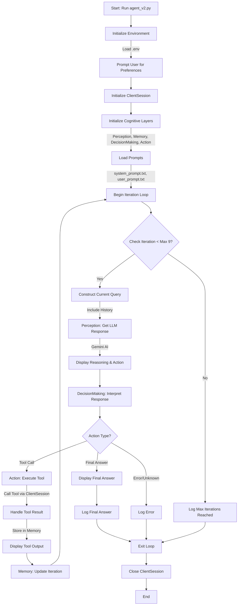

# AI Agent Framework

## Overview
The **AI Agent Framework** is a sophisticated, modular system designed to execute complex tasks iteratively through the integration of external tools and advanced AI reasoning capabilities. The framework leverages a structured approach to task execution, incorporating perception, memory, decision-making, and action components to ensure precise and reliable outcomes. This system is particularly suited for applications requiring sequential task processing, tool integration, and user preference-driven outputs.

The entry point of the framework is `agent_v2.py`, which orchestrates the interaction between various modules to achieve the desired functionality. The system is built to handle tasks such as data lookup, arithmetic computations, graphical operations, and communication tasks, all while maintaining a robust error-handling mechanism and adhering to strict output formatting rules.

## Features
- **Modular Architecture**: Comprises distinct modules for perception, memory, decision-making, and action, ensuring clear separation of concerns and ease of maintenance.
  - **Perception Layer** - Interfaces with Large Language Models (Google Gemini 2.0 Flash) to interpret instructions and generate reasoned responses.
  - **Memory Layer** - Maintains task history, iteration state, and user preferences across execution cycles.
  - **Decision-Making Layer** - Analyzes LLM responses and determines appropriate next actions based on structured output.
  - **Action Layer** - Executes determined actions through registered tools and processes responses.
- **Tool Integration**: Supports a variety of external tools for tasks such as generating Fibonacci numbers, performing arithmetic operations, manipulating Microsoft Paint, and sending communications via email or Telegram.
- **Reasoning Types**: Implements multiple reasoning strategies, including lookup, arithmetic, planning, tool-use, validation, and communication, to address diverse task requirements.
- **User Preferences**: Incorporates user-defined preferences to customize task execution and communication outputs.
- **Error Handling**: Robust mechanisms to handle tool failures, retry operations, and proceed with partial results to maximize task completion.
- **Structured Output**: Enforces strict JSON-based output formats for tool calls and final answers, ensuring consistency and interoperability.
- **Logging and Debugging**: Comprehensive logging capabilities for monitoring system behavior and diagnosing issues.



This Mermaid diagram illustrates the workflow of the **AI Agent Framework** as implemented in `agent_v2.py`. It captures the initialization process, iterative task execution, decision-making, tool usage, and termination conditions, reflecting the modular and structured nature of the system.
## Prerequisites
To deploy and utilize the AI Agent Framework, ensure the following prerequisites are met:
- **Python**: Version 3.8 or higher.
- **Dependencies**: Install required Python packages listed in `requirements.txt` using:
  ```bash
  pip install -r requirements.txt
  ```
- **Environment Variables**:
  - `GEMINI_API_KEY`: API key for the Gemini AI model.
  - `SENDER_EMAIL`: Gmail address for sending emails.
  - `GMAIL_APP_PASSWORD`: App-specific password for Gmail SMTP.
  - `TELEGRAM_API_KEY`: API key for Telegram Bot API.
  Configure these in a `.env` file using the `python-dotenv` package.
- **Operating System**: Windows (required for Microsoft Paint integration).
- **External Tools**: Microsoft Paint must be installed for graphical operations.

## Installation
1. **Clone the Repository**:
   ```bash
   git clone <repository_url>
   cd <repository_directory>
   ```
2. **Set Up a Virtual Environment** (recommended):
   ```bash
   python -m venv venv
   source venv/bin/activate  # On Windows: venv\Scripts\activate
   ```
3. **Install Dependencies**:
   ```bash
   pip install -r requirements.txt
   ```
4. **Configure Environment Variables**:
   Create a `.env` file in the project root and add:
   ```plaintext
   GEMINI_API_KEY=<your_gemini_api_key>
   SENDER_EMAIL=<your_gmail_address>
   GMAIL_APP_PASSWORD=<your_gmail_app_password>
   TELEGRAM_API_KEY=<your_telegram_bot_token>
   ```
5. **Verify Setup**:
   Ensure all dependencies are installed and environment variables are correctly set.

## Usage
The framework is executed via the `agent_v2.py` script, which serves as the main entry point. To run the program:
```bash
python agent_v2.py
```

### Workflow
1. **Initialization**:
   - The script loads environment variables and initializes a `ClientSession` for tool communication.
   - Cognitive layers (`Perception`, `Memory`, `DecisionMaking`, `Action`) are instantiated.
2. **User Input**:
   - The user is prompted to provide preferences for task execution (e.g., communication method).
3. **Task Execution**:
   - The system processes a predefined task sequence (defined in `user_prompt.txt`), such as:
     - Generating Fibonacci numbers.
     - Computing squares or cubes.
     - Summing results.
     - Performing graphical operations in Microsoft Paint.
     - Sending results via email or Telegram.
   - Each step involves a single tool call, with intermediate results stored in memory.
4. **Output**:
   - The system outputs JSON-formatted responses for each tool call and a final answer.
   - Results are displayed in a rich console interface with panels for reasoning, actions, and outputs.
5. **Termination**:
   - The process terminates upon reaching the final answer or the maximum iteration limit (default: 9).

### Example Task
The default task (defined in `user_prompt.txt`) involves:
- Generating the first `n` Fibonacci numbers.
- Computing their squares or cubes.
- Summing the results.
- Opening Microsoft Paint and drawing a rectangle.
- Adding text to the Paint canvas with the sum.
- Sending the results via email or Telegram based on user preferences.

Sample output for a tool call:
```json
{
  "reasoning": "To begin the task, I need to generate the first 5 Fibonacci numbers as specified.",
  "action": {
    "type": "function_call",
    "tool_name": "find_first_fibonacci_numbers",
    "tool_input": {"n": 5}
  }
}
```

Sample final answer:
```json
{
  "reasoning": "All steps completed, and results communicated as per user preferences.",
  "action": {
    "type": "final_answer",
    "answer": "Task completed successfully."
  }
}
```

## Project Structure
The framework is organized into several key files:
- **`agent_v2.py`**: Main entry point, orchestrates task execution and module interactions.
- **`action.py`**: Handles tool execution via the `ClientSession`.
- **`decision_making.py`**: Interprets LLM responses and determines the next action.
- **`memory.py`**: Manages iteration tracking, response storage, and history generation.
- **`perception.py`**: Interfaces with the Gemini AI model for reasoning and response generation.
- **`models.py`**: Defines Pydantic models for tool inputs and outputs.
- **`mcp_server_pydantic.py`**: Implements the MCP server and tool functions.
- **`prompt_loader.py`**: Loads and formats prompt templates.
- **`system_prompt.txt`**: Defines the system prompt with instructions and rules.
- **`user_prompt.txt`**: Specifies the task sequence and output format.

## Tool Descriptions
The framework supports the following tools (defined in `mcp_server_pydantic.py`):
- **strings_to_chars_to_int**: Converts a string to ASCII values.
- **int_list_to_exponential_sum**: Computes the sum of exponentials of a list of numbers.
- **find_first_fibonacci_numbers**: Generates the first `n` Fibonacci numbers.
- **calculate_cubes**: Computes cubes of a list of numbers.
- **calculate_squares**: Computes squares of a list of numbers.
- **calculate_sum**: Sums a list of numbers.
- **open_paint**: Opens and resets Microsoft Paint.
- **draw_rectangle**: Draws a rectangle in Microsoft Paint.
- **add_text_in_paint**: Adds text to the Paint canvas.
- **send_email**: Sends an email via Gmail SMTP.
- **send_telegram**: Sends a message via Telegram Bot API.

Each tool is defined with Pydantic models to ensure input and output validation.

## Logging
- **Agent Logs**: Stored in `agent.log` with detailed information on iterations, LLM responses, and errors.
- **MCP Server Logs**: Stored in `mcp_server.log` for tool execution details.
- Logs are formatted with timestamps and log levels for easy debugging.

## Error Handling
The framework includes robust error handling:
- **Tool Errors**: Retries failed tool calls once if logical, otherwise skips the step and proceeds.
- **Validation Errors**: Uses Pydantic to validate tool inputs and outputs, logging any issues.
- **Unexpected Results**: Stores partial results and uses placeholders to continue task execution.
- **Maximum Iterations**: Terminates after 9 iterations to prevent infinite loops.

## Limitations
- **Platform Dependency**: Microsoft Paint operations require a Windows environment.
- **Network Dependency**: Email and Telegram functions require internet connectivity and valid API credentials.
- **Tool Coordinates**: Paint tool coordinates (e.g., for rectangle or text tools) may need adjustment based on screen resolution.
- **Gemini API**: Requires a valid API key and may be subject to rate limits.

## Contributing
Contributions to the AI Agent Framework are welcome. To contribute:
1. Fork the repository.
2. Create a feature branch (`git checkout -b feature/<feature_name>`).
3. Commit changes (`git commit -m "Add <feature_name>"`).
4. Push to the branch (`git push origin feature/<feature_name>`).
5. Open a pull request with a detailed description of the changes.

Please adhere to the coding standards and include unit tests for new features.

## License
This project is licensed under the MIT License. See the `LICENSE` file for details.

## Contact
For inquiries or support, please contact the project maintainers at <maintainer_email>.

---

*Last Updated: April 26, 2025*
